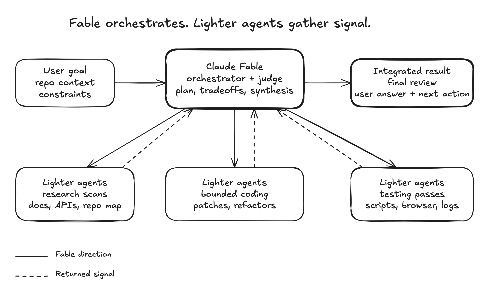

# Skills for coding agents

Small, composable skills for coding agents.

These skills are for teams that want the agent to stay sharp where judgment
matters: orchestration, review, planning, validation, and clear communication.
They are not a giant process framework. Install the pieces you want, adapt them
to your project, and let the model keep room to think.

## Skills

### [`/efficient-fable`](skills/efficient-fable/README.md)

Use Claude Fable as the orchestrator, architect, synthesizer, and final judge
while lighter agents handle token-heavy research, coding, testing, and log
reduction.

Solves for expensive-model waste: Fable should spend tokens on judgment, not on
reading every file, reducing every log, or manually running every browser check.

### [`/efficient-frontier`](skills/efficient-frontier/README.md)

Apply the same orchestration pattern to any high-cost frontier model: preserve
the expensive model for planning, tradeoffs, integration, validation strategy,
and final review; use cheaper agents for bounded heavy lifting.

Solves for broad work that can be parallelized without asking the most expensive
model to do every scan and every edit itself.



### [`/stay-within-limits`](skills/stay-within-limits/README.md)

Check current 5-hour and weekly usage before substantial work and between
parallel waves, then pause new execution at 95% until the active window is clear
enough to continue.

Solves for long-running agent sessions that accidentally exhaust the current
budget window mid-task instead of pausing cleanly and resuming with a
self-contained plan.

### [`/visual-plan`](skills/visual-plan/README.md)

Turn risky plans into human-optimized MDX documents with custom visual blocks:
diagrams, wireframes, prototypes, visual schema maps, OpenAPI-style API specs,
annotated code, open questions, and review comments.

Solves for plans that are too important to bury in chat. The output is
scannable, commentable, and intuitive enough for a human to approve before code
changes start.

### [`/visual-recap`](skills/visual-recap/README.md)

Turn a branch, commit, or PR diff into a human-optimized visual recap with MDX
and custom components: annotated diffs, diagrams, API diffs, visual schema maps,
file maps, and UI state summaries.

Solves for diffs that hide the shape of the change. Reviewers can understand
contracts, architecture moves, schema changes, and UI impact before diving into
raw line-by-line review.

### [`/quick-recap`](skills/quick-recap/README.md)

Add a concise final status block convention so every completed response ends
with a clear green, yellow, or red work-state signal.

Solves for ambiguity at the end of agent work: done, pending a specific
non-routine step, or blocked on the user.

Example green status:

```md
---

⠀
🟢 Updated quick recap docs with output examples
```

Example yellow status:

```md
---

⠀
🟡 Set PROVIDER_WEBHOOK_SECRET before testing webhooks
```

## Install

Install the collection:

```sh
agent-native skills add BuilderIO/skills
```

Pick the skills you want, choose Codex, Claude Code, or both, and decide whether
to add managed `AGENTS.md` / `CLAUDE.md` instruction blocks for always-on
conventions.

Useful one-liners:

```sh
agent-native skills add BuilderIO/skills --skill efficient-fable --update-instructions
agent-native skills add BuilderIO/skills --skill stay-within-limits --update-instructions
agent-native skills add BuilderIO/skills --skill quick-recap --update-instructions
agent-native skills add BuilderIO/skills --skill visual-recap --with-github-action
```

Instruction-only fallback:

```sh
npx @agent-native/skills@latest add BuilderIO/skills
```

The open Vercel skills installer can also copy the skill folders, but it does
not manage `AGENTS.md` / `CLAUDE.md` blocks or write the Visual Recap workflow:

```sh
npx skills add BuilderIO/skills --skill quick-recap
```

## Sync Agent Native Plan Skills

`/visual-plan` and `/visual-recap` are copied from Agent Native. From this repo:

```sh
npm run sync:agent-native-plan-skills
```

The sync script defaults to `../agent-native/framework`. Override the source
with a path argument or environment variable:

```sh
AGENT_NATIVE_FRAMEWORK_PATH=/path/to/agent-native/framework npm run sync:agent-native-plan-skills
npm run sync:agent-native-plan-skills -- /path/to/agent-native/framework
```

In the Agent Native repo, a workflow opens or updates a PR here whenever the
canonical visual skill files change on `main`. Human-facing `README.md` files in
the public repo are preserved as documentation overlays during sync.
