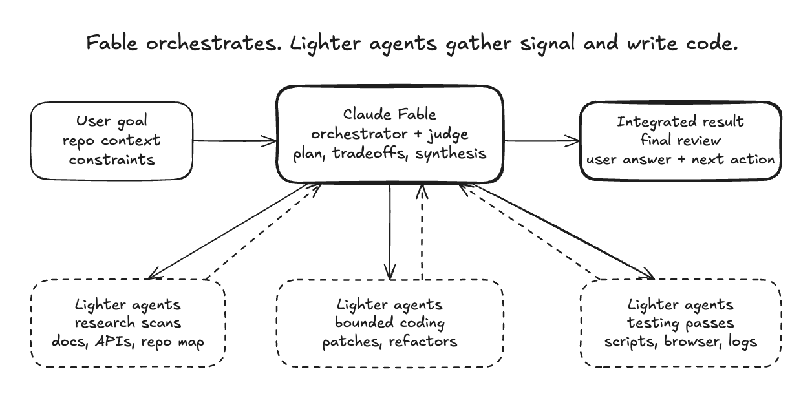

# /efficient-opus

Use Claude Opus where it is worth paying for judgment.

`/efficient-opus` helps an Opus-class model orchestrate codebase-heavy work
without spending premium tokens on every scan, log, browser run, and bounded
edit. Opus keeps the hard calls: decomposition, architecture, product tradeoffs,
synthesis, risk, and final review. Lighter agents do the repeatable heavy
passes.

<picture>
  <source media="(prefers-color-scheme: dark)" srcset="assets/opus-orchestrator-dark.png">
  <source media="(prefers-color-scheme: light)" srcset="assets/opus-orchestrator.png">
  
</picture>

## What It Does

- Splits large work into research, coding, and testing lanes.
- Tells Opus to choose the strategy, validation direction, and review bar.
- Encourages cheaper agents to scan repos, summarize docs, reduce logs, run
  browser checks, and attempt bounded patches.
- Keeps evidence flowing back to Opus as files, commands, diffs, failures, and
  uncertainties.
- Uses self-contained handoff packets so delegated agents can work without
  hidden context from the orchestrator chat.
- Reminds Opus to verify important delegated claims before relying on them.

## When To Use It

Use this when the task is too broad for one expensive model pass: unfamiliar
repos, long test output, multi-file changes, product/architecture ambiguity, or
validation work that can run in parallel.

Skip it for tiny fixes, highly coupled edits, or judgment-sensitive debugging
where delegating would create more coordination cost than it saves.

## Testing Guidance

Opus should suggest the validation direction and name the scripts or browser
flows that matter. Lighter agents can run those checks, collect screenshots,
reduce logs, and report whether failures look real, flaky, or environmental.

The point is not to outsource responsibility. Opus still decides what signal is
trustworthy.

## Delegation Quality

Good handoffs include the repo path, exact objective, in-scope and out-of-scope
areas, expected evidence, verification commands, and stop conditions. A lighter
agent should know when to stop and report instead of widening the task on its
own.

Opus should treat delegated reports as leads. For important decisions, it
reopens the cited files or logs and checks that the evidence really supports the
claim.

## Diagram

Editable Excalidraw source:
[`assets/opus-orchestrator.excalidraw`](assets/opus-orchestrator.excalidraw)

Rendered PNGs:
[`assets/opus-orchestrator.png`](assets/opus-orchestrator.png)
and
[`assets/opus-orchestrator-dark.png`](assets/opus-orchestrator-dark.png)

## Install

```sh
npx @agent-native/skills@latest add --skill efficient-opus --update-instructions
```

Use `--update-instructions` when you want the Opus delegation convention added
to `AGENTS.md` or `CLAUDE.md` automatically.
